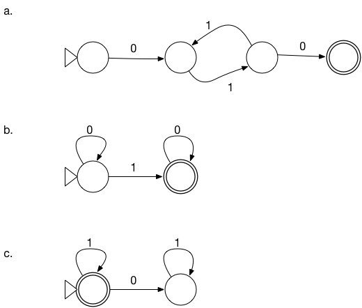

# FOCS Day 7 Homework

## 1. FSA to Regular Expression

Convert (a), and at least one of (b) and (c), to a regular expression.

a) 01(11)\*0

b) 0\*10\*

c) 1\*

## 2. Parenthesis Matching

**a**. Construct a regular expression that matches strings where each `(` is followed immediately by a `)`.

Positive examples: `()`, `()()()`

Negative examples: `(()`, `(())`

*answer:* ([alphabet]\*('()')\*)\*
or "()"*

**b**. Construct a regular expression that matches strings where the parentheses match, with depth <= 2.

Positive example: `()(()())()`

Negative examples: `((()))`, `((())())` have three levels of neseting.

*answer:* ("{}"U('{'"{}"\*'}'))\*

({} instead of () for readability)

**c**. Construct a regular expression that accepts strings where the parentheses match, with depth <= 3.

Positive examples: `()(()())()`, `(()(()()))()`

Negative example: `(((())))` has four levels of nesting.
*answer:* ( ( "{}" U ( '{' "{}"\* '}' ) ) U ( "{" ( '{' "{}"\* '}' )* "}" ) )\*

## 3. [optional] Challenge Problems

Construct these. Some you may be able to do by just by thinking. Some may be easier if you construct an automaton and then convert it.

- A regular expressions that matches strings with an odd number of 1s.

*answer:* 0\* 1 0\* (1 0\* 1)\*

- A regular expressions that matches strings with an even number of 0s.

*answer:* 1\* (0 1\* 0)\*

- A regular expressions that matches strings with an odd number of 1s AND an even number of 0s.

*answer:* (0 (11)\* 0)\* (1 U 010) ((00) U ((1 U 010) (1 U 010)))\*

- A regular expressions that matches strings with an odd number of 1s OR an even number of 0s.

*answer:* left as an exercise for the ninjas

## 4. [optional] Regular Expression practice
These are excellent sources to learn more about, and practice, applied regular expressions.

- [regexcrossword.com](https://regexcrossword.com)
- [regexone.com](https://regexone.com)

## 5. [optional] Extended Regular Expressions

Learn about [character classes](https://regexone.com/lesson/letters_and_digits) `\d\d\d-\d\d\d\d`, [repetition with quantifiers](https://regexone.com/lesson/repeating_characters) `a{2,4}`, [backreferences](http://www.regular-expressions.info/backref.html) `(a|b|c)def\1`, and [anchors](http://www.regular-expressions.info/anchors.html) (`\bword\b`).

Which of these are just notational conveniences, like `[abc]` for `(a|b|c)`?

*answer:* all of them:
\d = [0-9]
a{2,4} = aaa?a?
(a|b|c)def\1 = (adefa|bdefb|cdefc)
\b = [\s;:\.\?!'"] (maybe it has a Kleen plus... dunno)

Which increase the power of regular expressions?
*answer:* I guess that leaves none...
